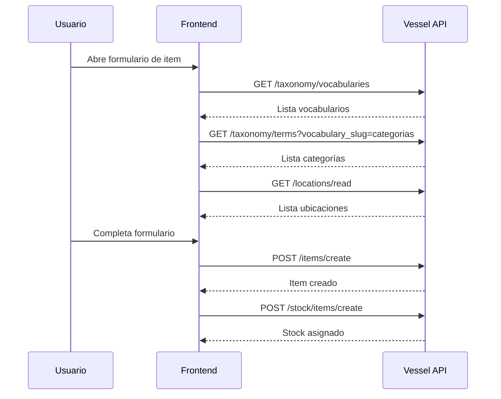

# Flujo de Registro de Items

Guía paso a paso para registrar items en el inventario con categorías, etiquetas y ubicaciones.

## Flujo Completo



## 1. Crear Vocabularios (una vez)

Los vocabularios definen tipos de clasificación: categorías, marcas, etiquetas.

```bash
# Crear vocabulario de categorías
curl -X POST http://127.0.0.1:10999/api/v1/taxonomy/vocabularies/create \
  -H "Content-Type: application/json" \
  -d '{"name": "Categorías", "machine_name": "categorias"}'

# Crear vocabulario de marcas
curl -X POST http://127.0.0.1:10999/api/v1/taxonomy/vocabularies/create \
  -H "Content-Type: application/json" \
  -d '{"name": "Marcas", "machine_name": "marcas"}'
```

## 2. Crear Términos (categorías/tags)

```bash
# Crear categoría "Electrónica"
curl -X POST http://127.0.0.1:10999/api/v1/taxonomy/terms/create \
  -H "Content-Type: application/json" \
  -d '{
    "name": "Electrónica",
    "vocabulary_id": "uuid-vocabulario-categorias"
  }'
```

## 3. Crear Ubicación

```bash
curl -X POST http://127.0.0.1:10999/api/v1/locations/create \
  -H "Content-Type: application/json" \
  -d '{
    "name": "Almacén Principal",
    "type": "warehouse"
  }'
```

## 4. Crear Item con Categoría

```bash
curl -X POST http://127.0.0.1:10999/api/v1/items/create \
  -H "Content-Type: application/json" \
  -d '{
    "name": "Arduino Uno",
    "description": "Placa de desarrollo Arduino",
    "term_ids": ["uuid-categoria-electronica", "uuid-marca-arduino"]
  }'
```

## 5. Asignar Stock a Ubicación

```bash
curl -X POST http://127.0.0.1:10999/api/v1/stock/items/create \
  -H "VESSEL-ACCESS-PRIVATE: tu-token" \
  -H "Content-Type: application/json" \
  -d '{
    "sku": "ARD-UNO-001",
    "catalog_item_id": "uuid-item-arduino",
    "location_id": "uuid-almacen-principal",
    "quantity": 50
  }'
```

## 6. Verificar Item con Stock y Taxonomía

```bash
curl "http://127.0.0.1:10999/api/v1/items/read?with_stock=true&with_terms=true"
```

## Endpoints Relacionados

| Módulo | Documentación |
|--------|---------------|
| Items | [Items API](./items) |
| Taxonomy | [Taxonomy API](./taxonomy) |
| Locations | [Locations API](./locations) |
| Stock | [Stock API](./stock/overview) |
